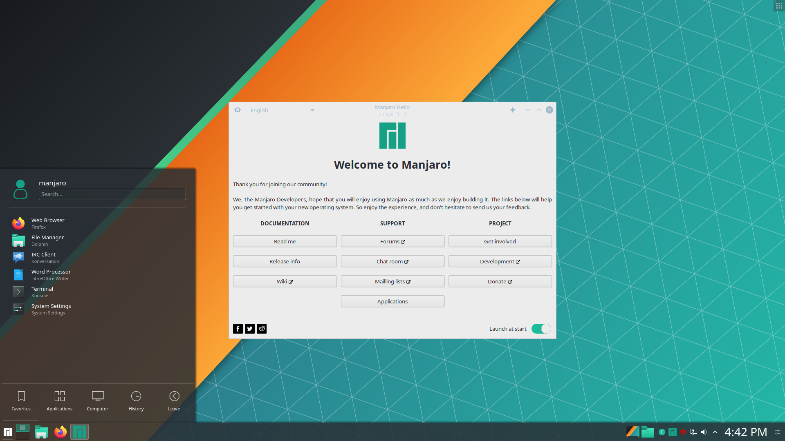

# Desktop Linux for Non-Linux Users

*2020-07-27 by Calvin Huang* 

<picture>
    <source id="s1" srcset="/posts/images/zorin12.1.png">
    <souce id="s2" srcset="images/zorin12.1.png">
    
</picture>

## Table of Contents

- [Desktop Linux for Non-Linux Users](#desktop-linux-for-non-linux-users)
  - [Table of Contents](#table-of-contents)
  - [Introduction](#introduction)
    - [What is a distribution?](#what-is-a-distribution)
    - [What is a desktop environment?](#what-is-a-desktop-environment)
    - [Why Linux?](#why-linux)
  - [Beginner-friendly Distributions](#beginner-friendly-distributions)
    - [Ubuntu](#ubuntu)
    - [Linux Mint](#linux-mint)
    - [Pop! OS](#pop-os)
    - [Manjaro](#manjaro)
    - [elementary OS](#elementary-os)
    - [Zorin OS](#zorin-os)
    - [Deepin OS](#deepin-os)
    - [Ubuntu DDE](#ubuntu-dde)
  - [Recommended Desktop Environments](#recommended-desktop-environments)
    - [GNOME 3](#gnome-3)
    - [KDE](#kde)
    - [Cinnamon](#cinnamon)
    - [DDE](#dde)
  - [TL;DR](#tldr)

## Introduction

Many beginner users of Linux will ask about the best distributions to use, as it is often a daunting task to step into the vast array of offerings. There are many cursory lists out there, but few of them go into the details of why certain distributions are good for beginners.

### What is a distribution?

<picture>
    <source id="s1" srcset="/posts/images/distros.webp">
    <souce id="s2" srcset="images/distros.webp">
    
</picture>

A Linux distribution is an operating system built on the Linux kernel and the GNU toolkit. The reason there are multiple distributions is that different distributions have different package managers, default software packages, window managers, desktop environments, and more. Essentially, what makes a distribution is what is built around the kernel and core toolkit. Many enthusiasts will argue that all distributions are essentially the same, and while that is technically true, reliability and convenience of using different distributions vary a lot. Most distributions you will come across ultimately boil down those based on Arch Linux, Debian, or Fedora. These three serve different roles, which Arch Linux being suited for the bleeding-edge, Debian being known for its stability, and Fedora being targeted towards system admins and enterprise desktops.

### What is a desktop environment?

A desktop environment consists of all elements of the graphical user interface, such as icons, windows, graphical file managers, and terminal emulators; basically anything you will interact with on your typical operating system other than the command line. Desktop environments are packaged with distributions, but are interchangeable, and nothing is stopping you from having multiple installed and switching between them. Desktop environments are often responsible for the overall look and feel of a system and can be easily configured and customized. For more details of certain desktop environments that I recommend, go to the Desktop Environments section.

### Why Linux?

<picture>
    <source id="s1" srcset="/posts/images/tuxmug.jpg">
    <souce id="s2" srcset="images/tuxmug.jpg">
    
</picture>

1. **Linux is based on free and open-source software.**

   Free, as in both monetary value and personal freedom. The later, being more important, means freedom from proprietary restrictions on what you can or cannot do, freedom from being tracked by companies collecting your data, and freedom to choose what you want your software to be able to do.

   Open source software offers more security compared to most proprietary solutions, especially in terms of the operating system, where bugs are identified quickly and therefore patched quickly due to the source code for Linux distributions being available for the whole world to see. This also makes it hard for companies to add trackers or back-doors. When Canonical added trackers to Ubuntu, the backlash was quick and unanimous, forcing the company to be completely transparent about the feature and offer options for disabling it.

2. **Linux is more functional**

   While in certain use cases, such as graphic design and music mixing, Linux has a shortage of open-source solutions, the open source offerings make Linux more functional for most users.

   There is an outdated notion that Linux is only for developers or the tech-savy, and while that may have been true a decade ago, desktop Linux has advanced to a point where it is easier to install Linux than it is to install Windows or OSX. In fact, a distribution like Pop! OS probably has the easiest installation process possible. Nowadays, many distributions simply work out-of-the box, and while many proprietary offerings don't work on Linux, just as many do, such as Zoom, Chrome, Microsoft Office (with Wine).

   For developers, Linux is unequivocally the best choice. Currently, KWM technology makes visualization in Linux much more capable than on other system, offering almost native speeds. Linux is also the fastest development platform, with innumerable development tools assuming that you're working on Linux. And while you can use Linux through something like WSL1/2 or the bash terminal in Mac OS, you don't get the flexibility of the graphical interfaces offered by full Linux desktops that have advanced far beyond the offerings of Windows and Mac OS.

3. **The community**

   Have you ever tried to fix something in Windows or on Mac OS? It almost never works out. You end up on the official support forums or at the end of a phone line where the support team, none of whom are familiar with the actual inner workings of the operating system, try to diagnose your problem wit repetitive scripts before they give up and mark your issue as closed even though you're stuck with the same problem by the end of the fiasco.

   The fundamental problem with supporting proprietary software is that when users encounter issues, many of them can only be solved by the software developers themselves or by those familiar with the structure of the software. However, large the team of developers is, it is difficult for customers to get proper support for issues that the support desk does not fully understand, as no one outside of the development team knows the code well enough.

   With open source software, bugs are in broad daylight. If Ubuntu 20.04 has a black screen problem, the entire world has access to the source code and the ability to solve it. While it may seem a bit more tedious to sift through forums for a solution for a rare issue, it is ultimately more productive than being led in circles by someone who doesn't understand your issue.

   This is among one of the many reasons why the community is one of the greatest aspects of open source software. Even of you aren't personally familiar with the inner workings of Linux, there are countless people who are, and who have spent time dealing with any potential software issues you might encounter, however uncommon. Or even if you're the first one to stumble upon a bug in a new release, the community will be there to offer support. When you join the open source community, you gain access to the largest software knowledge base in the world.

## Beginner-friendly Distributions

Despite the lack of support by the Linux Foundation for desktop Linux development, many distributions are focused on delivering a complete desktop experience. Here is a list of highlights from the distributions that meet my criteria for beginner friendliness, as well as completeness as desktop OS alternatives to Windows and OSX.

### Ubuntu

<picture>
    <source id="s1" srcset="/posts/images/ubuntu20.04.png">
    <souce id="s2" srcset="images/ubuntu20.04.png">
    
</picture>

Ubuntu is the classic choice for beginners to Linux. With long-term support for releases and all the built-in functionality of the GNOME 3 desktop, Ubuntu provides a devent out-of-the-box experience with little customization needed. Ubuntu also provides alternative flavors, such as Kubuntu and Xubuntu, which offer difference desktop environments such as KDE and XFCE, which may cater more to users used to the Windows 10 look and feel. 

If you stick with base Ubuntu, however, you get a customized GNOME 3 desktop with many of Canonical's built-in applications, which cover most day-to-day functionality. GNOME 3 has many easy-to-install extensions and applications that can allow for easy customization. However, GNOME has sometimes been criticized for being bloated and having limit out-of-the-box customization.

 The main advantage of Ubuntu is it's stability and large community. It comes with the `apt` and `synaptic` package managers that are a convenient way to download safe and stable packages, and many Ubuntu-related issues have already been resolved by the community on many different platforms. This is the reason why so many of the distributions on this list take inspiration or are derived from Ubuntu. The main downside of Ubuntu is also it's stability. Being based on Debian, it inherits the slow package upgrades, often lagging behind many versions to ensure complete stability, which can be annoying for users who want to be on the bleeding edge with the newest versions of packages. 

Canonical, the developers of Ubuntu, are also not the most transparent company, and have been known to include trackers among the automatically downloaded Ubuntu software. This is a minor annoyance though, as it's pretty easy to disable these features. They have also been recently pushing snap packages as a method of downloading new software, which is disliked by many developers and users for being bloated and insecure for automatically handling dependencies. However, if you're looking for the go-to Linux distribution that just works, Ubuntu is a solid choice and is what I actually run as my daily driver.

### Linux Mint

<picture>
    <source id="s1" srcset="/posts/images/linuxmint18.2.png">
    <souce id="s2" srcset="images/linuxmint18.2.png">
    
</picture>

Linux Mint is also known as a very beginner-friendly distribution. Being based on Ubuntu, it inherits most of the same advantages, as well as also having its own very large community. However, Mint also removes much of the undesirable features that are packaged with base Ubuntu, such as snap packages and tracking.

Linux Mint also comes with Cinnamon desktop environment that is a blend of XFCE and GNOME in terms of look and feel. Cinnamon is an excellent and user-friendly desktop environment that takes many of the features of GNOME 3 but packs it into a more Windows-like, conservative interface. Cinnamon is now so beloved that it is offered on many other distributions and can even be downloaded for Ubuntu.

Overall, many of the same things about Ubuntu could be said for Linux Mint, but the team being Linux Mint is completely transparent and dedicated to open-source software.

### Pop! OS

<picture>
    <source id="s1" srcset="/posts/images/popos20.04.png">
    <souce id="s2" srcset="images/popos20.04.png">
    
</picture>

Pop! OS is an Ubuntu-based distributions that, similar to Linux mint, comes with the advantages of Ubuntu while removing some of the disadvantages, such as tracking. Pop! OS also comes with many advantages over Ubuntu, with performance tweaks and a more convenient app store for people who don't want to use the terminal. In fact, one Youtube video showcased how a full gaming setup for Pop! OS that didn't require any use of the terminal at all!

There are also many subtle features of Pop! OS that make it particularly good for gaming and development, such as its easy interface for switching between graphics cards, its easy installation and disk encryption for security, and its built in tiling window manager-like tool called the Pop Shell. This was developed specifically for GNOME shell and is included by default on Pop! OS (although you can manually download it for any GNOME environment). If you aren't aware of what a tiling window manager is, they are essentially desktop environments optimized for keyboard-based work-flows that function with automatic tiling of windows rather than floating windows. With Pop Shell, you can get the best of both worlds out-of-the box by toggling window tiling with a single shortcut. 

Pop! OS also features an app store of its own called the Pop Shop that is leagues more accessible compared to Ubuntu's offerings. The Pop Shop is your one-stop-shop for updating, installing, and removing software, similar to the app store on Mac. This allows almost any application to be installed graphically.

In addition, System76, the developers of Pop! OS, are champions of open source development and hardware, with the company selling many top-of-the-line open source laptops and desktops with Pop! OS built in. If you plan to do any gaming or want a simple, modern-looking GNOME desktop, Pop! OS is definitely an amazing choice for any beginner to Linux, especially if you never want to touch the terminal.

### Manjaro

<picture>
    <source id="s1" srcset="/posts/images/manjarognome.png">
    <souce id="s2" srcset="images/manjarognome.png">
    
</picture>

Manjaro is for users who want the benefits of bleeding-edge software while still having an easy-to-use graphical interface and stellar performance. Based on Arch Linux rather than Ubuntu/Debian, Manjaro comes on top compared to the aforementioned distributions when it comes to offering the most up-to-date versions of software packages with the `pacman` package manager. This offers an advantage for gamers, developers, and power users who want the newest features, especially with software under development such as the Proton engine for Windows games on LInux. However, this does make some packages somewhat less stable than Ubuntu (although I have personally never run into problems).

Manjaro does not come with a default desktop environment, offering a choice from the get-go of either XCFE, KDE, or GNOME, which are all solid choices on Manjaro. I have personally tried both the KDE and GNOME editions, and both are classic takes on two very popular desktop environments.

Similar to Ubuntu, Manjaro offers support for a vast array of software repositories due to being derived from Arch, and its community, while being smaller than Ubuntu's is quite large and is growing by the day. Users familiar with Arch Linux might have heard of the hurdles of installing it; none of that applies to Manjaro, and you can probably use it as a daily driver without needing to touch the terminal as long as you aren't using developer tools. For those looking for the newest software but want an out-of-the-box setup with many options for customization, Manjaro offers the best of both worlds.

### elementary OS

<picture>
    <source id="s1" srcset="/posts/images/elementaryluna.png">
    <souce id="s2" srcset="images/elementaryluna.png">
    
</picture>

elementary OS is another Ubuntu-based distribution with the unique Pantheon desktop environment. Quite simply, elementary OS has less bloat compared to base Ubuntu and removes any built-in tracking features. Similar to Linux Mint, the design philosophy behind elementary OS is that of ease-of-use and minimalism as opposed to customization. 

The Pantheon desktop environment is eye candy and is quite reminiscent of the design of OSX. It implements its own session manager (not the usual offerings such as lightdm and gdm3) and has a lot of the features from GNOME. elementary OS also comes with its own suite of custom software such as its unique code editor and plank dock.

Overall, if you're a Mac user and are looking for a distribution that doesn't need much customization, but works out-of-the-box, elementary OS is a solid choice. However, it does heavily constrain customization and is made for primarily mouse-based usage, so it is not a good fit for users who want more customization options for their desktop or want to experiment with different settings and use cases. But if you're an average user who just wants to get away from Windows and Mac OS without worrying about the huge number of options many distributions offer, elementary OS may be the perfect fit.

### Zorin OS

<picture>
    <source id="s1" srcset="/posts/images/zorin15.png">
    <souce id="s2" srcset="images/zorin15.png">
    
</picture>

Zorin OS is an Ubuntu-based distribution that will make any Windows or Mac user feel at home. The current default interface uses a customized GNOME desktop that offers accessible options that allow users to make the desktop resemble either Mac OS or Windows 10, but I would say that Windows users would probably be slightly more comfortable with the look and feel.

Zorin OS comes with several editions, but the Core edition is a solid choice for most users (although content creators may want to consider the ultimate edition). The reason Zorin is a better choice than many of the distributions on this list is much of the built-in functionality. Zorin comes with easy installation of the Wine comparability layer, which offers functionality for many Windows applications. For example, it is pretty easy to install Microsoft Office and games using Wine in Zorin, as it will automatically handle the Wine installation for you when you try to install any `.exe` or `.msi` files. This is a great time-saver for users who don't want to go through a potentially tedious installation of Wine and greatly reduces the barrier of entry for Windows users.

Zorin offers a great experience and built-in software, offering packages from both the Ubuntu repositories and its own. If you're someone who wants support for Windows applications and an intuitive interface, Zorin OS is a solid choice, and in my opinion, offers more functionality than elementary OS.

### Deepin OS

<picture>
    <source id="s1" srcset="/posts/images/deepin15.1.jpg">
    <souce id="s2" srcset="images/deepin15.1.jpg">
    
</picture>

Deepin OS is an under-appreciated gem of the desktop Linux world. The Deepin Desktop Environment (DDE) is packed full of awesome features for power-users and average users alike, and offers the best from Windows, Mac, and Linux desktops.

DDE can be customized into "efficient" or "fashion" mode, being Windows-like or Mac OS-like, respectively. Both modes look incredibly similar to their intended counterparts, with the panel/doc appearances being on-point. For Mac users, Deepin has an amazing app store that offers both open-source and proprietary software. While this may be a turn-off for dedicated free-and-open-source-software users, I believe that it is an important stepping stone needed to pull in users who are used to proprietary offerings. Deepin also comes with its own default software that is incredibly user-friendly and intuitive. Personally, I would describe DDE as a fusion of the best parts of KDE and GNOME with a bit less customization.

Similar to Zorin OS, Deepin OS also makes it incredibly easy to install Wine. This is especially useful because of the Windows applications that are offered in the app store can easily function out-of-the box without the hassle of manual installation of the compatibility layer or its dependencies. This makes Deepin OS really feel complete with smooth functionality with its app store offerings.

Deepin OS is also based on Debian, similar to Ubuntu, so it has access to a wide array of software repositories and is quite stable. The only concern that I have about Deepin OS is that its app store was once accused of tracking usage. While there is no evidence of this data being mishandled, this may be reason enough for privacy-oriented users to avoid Deepin OS for the time being (take a look at Ubuntu DDE below). However, as user experience goes, the fluidity of Deepin OS makes it the most functional desktop Linux distribution, in my option, for users coming from Windows or OSX.

### Ubuntu DDE

<picture>
    <source id="s1" srcset="/posts/images/ubuntudde.png">
    <souce id="s2" srcset="images/ubuntudde.png">
    
</picture>

Technically a flavor of Ubuntu, Ubuntu DDE is offered separately as an unofficial Ubuntu flavor that is seeking official status. However, Ubuntu DDE is slightly more than simply the Deepin Desktop Environment installed onto a generic Ubuntu offering. The DDE desktop for this distribution is optimized for use on Ubuntu, and the desktop environment can even been installed separately on an already existing Ubuntu install through the Ubuntu DDE PPA. 

As a desktop experience, Ubuntu DDE is similar to Deepin OS, but without the Deepin app store. However, much of the open source built-in offerings are the same, with all the advantages of the DDE interface on top of the advantages of Ubuntu in having more software repositories and customization options. However, support for Wine is not automatically built in, so that compatibility must be installed manually.

Ubuntu DDE is potentially better for users who want more customization and developers who want more control of their environment. It provides much of the functionality of Deepin OS without the worry of being tracked by the Deepin app store and is a great alternative for more users who want to the community support of Ubuntu and the fluidity of the Deepin Desktop.

## Recommended Desktop Environments

### GNOME 3

<picture>
    <source id="s1" srcset="/posts/images/gnome3.png">
    <souce id="s2" srcset="images/gnome3.png">
    
</picture>

GNOME is a great, modern desktop environment full of easy customization, albeit not as many options as KDE. Many options can be access by installing the GNOME Teaks Tool, which offers advanced options and settings for any GNOME extensions you download. The website for GNOME extensions offers a Chromium extension that allows you to one-click download extensions with great convenience.

GNOME 3 is currently the default for many different Linux distributions and has great community support, and it comes with many default utilities and software that just work out-of-the-box. While KDE is known for its absolute customization, GNOME offers a lot of customization options in a more simple format. It is generally more user-friendly to navigate GNOME options, making it a good desktop environment for new users and veterans who don't want to spend time making their desktop look good.

As with most desktop environments, GNOME allows you to navigate multiple workspaces with your mouse or with key-bindings, and most shortcuts are easily configurable in the settings menu. GNOME is also quite favorable due to the Pop Shell recently developed by the System76, which offers the functionality of a tiling window manager within the GNOME shell.

However, GNOME does get a lot a flak from certain parts of the community for being bloated with pre-installed software and not being as customizable as offerings such as KDE and XFCE. It generally runs with higher memory usage than other desktop environments, but it is still much lower than that of Windows or Mac OS.

### KDE

<picture>
    <source id="s1" srcset="/posts/images/manjarokde.png">
    <souce id="s2" srcset="images/manjarokde.png">
    
</picture>

KDE has had some shortcomings in the past, but it is currently one of the best desktop environments out there. Windows users, especially those that used older versions of Windows, may find the default layout of this environment particularly familiar, but it can pretty easily be configured to look identical to Windows 7/10, aside from the logo. Recent developments have made KDE run incredibly smoothly and efficiently, making it capable of being lightweight despite the decent amount of pre-installed software it can be installed with.

When discussing KDE, I have to mention the Dolphin file manager. File Nautilus and other alternatives on other desktop environments provide basic functionality, Dolphin has many more features than any other graphical offering. For one, it extensive panel customization, including the option for a built-in terminal and detailed file tree navigation. You also have an advanced places menu that is more customizable than other file managers. Dolphin is so good that I opted to download it despite the fact that I'm currently using GNOME as my desktop.

What really stands out about KDE is how customizable it is. Just like GNOME has its extensions and style packs, KDE has the KDE store with just as many, if not more, offerings. One of the most aesthetically pleasing add-ons is the Latte dock, with can be configured to operate similarly to the dock in Mac OS or GNOME, with KDE explicitly developing with Latte compatibility in mind. And just like GNOME and other desktop environments, you have the ability to navigate between workspaces, but in KDE's case, there are much more options for navigation. 

Just like GNOME, the community behind KDE is vast, and this makes offerings on the KDE store very comprehensive. If you really don't want to spend time going through KDE configuration options, you can easily download preloaded themes and style packages that will handle it for you. If you really want to keep a Windows or Mac OS appearance, there are quite a few packs that will handle every for you!

Similarly to Windows 7 and Mac OSX, KDE offers widgets that can be placed on the desktop or on panels/docks. These, like everything in KDE, are extremely customizable and allow you to control the appearance of your desktop. The KDE store allows even more widgets to be downloaded for even more options.

KDE is also extremely configurable by default, with endless options for key mappings, desktop configurations, etc... It can be slightly daunting for new users to tackle all of these options, but the payoff is definitely worth it if you stick it through. However, for people who don't want to spend so much time making their desktop look modern and personalized, KDE may not be the best option.

### Cinnamon

<picture>
    <source id="s1" srcset="/posts/images/cinnamon.png">
    <souce id="s2" srcset="images/cinnamon.png">
    
</picture>

Cinnamon is a desktop environment originally developed for Linux Mint that is now offered for many distributions. It offers many of the advantages of GNOME while being incredibly fast and lightweight. It also has many customization options, although not as much as KDE. Cinnamon overall offers a much more traditional-designed desktop experience with modern features and functionality.

Similar to KDE and old versions of GNOME, Cinnamon has widgets, instead calling them "desklets," which can be placed on the desktop. Applets are also available on the panel, and downloadable themes are available for more customization. Similar to GNOME, Cinnamon has a store for extensions for further functionality and flexibility.

Cinnamon's default applications, called "X-Apps," are based on core GNOME applications with more intuitive interfaces, and many of Cinnamon's default keybindings and options, such as its workspaces, are somewhat reminiscent of GNOME, albeit with more room for customization. However, Cinnamon's default look is very outdated, so it may not be appealing to some users without drastic customization. But overall, Cinnamon has desirable features from GNOME and other desktop environments while being one of the most intuitive to use.

### DDE

<picture>
    <source id="s1" srcset="/posts/images/deepin15.4.png">
    <souce id="s2" srcset="images/deepin15.4.png">
    
</picture>

If I haven't gushed about DDE enough in sections on Deepin OS and Ubuntu DDE, I'll continue here. For the new user, DDE out-paces the competition by leagues. I'm talking absolute Linux beginners who need some familiarity to pull them into the wonderful world of desktop Linux. 

As someone who has experience working and developing in both Windows 10 and Mac OS Catalina, DDE ticks all the right boxes as a desktop environment I would be comfortable with if I was just starting out. Easily the most convenient feature is the ability to put the environment in either "efficient" (Windows) or "fashion" (Mac OS) mode and just have it look right. No need for extra steps.

While I feel like a Mac users could easily adapt to GNOME and Windows users could easily adapt to Cinnamon, there is a certain psychological barrier of unfamiliarity in the slight difference in appearance. DDE blows that all away with a very familiar interface and intuitive design. The reason this is so important is that Mac OS and Windows don't offer much customization, so it can be daunting to use an OS that looks different and has many customization options; the relative lack of customization and aesthetic default appearance of DDE is actually a plus side for those unfamiliar with Linux. If I had recommend a Linux desktop environment to someone who isn't going to spend a lot of time trying to customize, I would definitely point them to the Deepin Desktop Environment.

However, DDE is currently not packaged with any distributions other than Ubuntu and Deepin OS, so downloading it on Manjaro may involve a terminal command or two, which defeats the purpose of appealing to the average user. This isn't much of a problem, since the users who would choose Manjaro would probably want more customizable options in a desktop environment or would know how to use the terminal, but this is a caveat worth mentioning.

## TL;DR

If you didn't want to read through an entire article or wanted a quick distro recommendation, here it is:

- Do you want full control, customization, and bleeding-edge software?: **Manjaro KDE** 
- Do you want full control, customization, and stability?: **Ubuntu**
- Do you want customizable gaming and workload performance?: **Pop! OS**
- Do you want a familiar desktop and are coming from Windows or Mac OS?: **Deepin OS**

If you were looking for a desktop environment recommendation:

- **KDE** for a lot of customization and features
- **Cinnamon** for simplicity with a decent amount of customization
- **DDE** for convenience and out-of-the-box aesthetics
- **GNOME** if you want more features, but don't want to spend time customizing