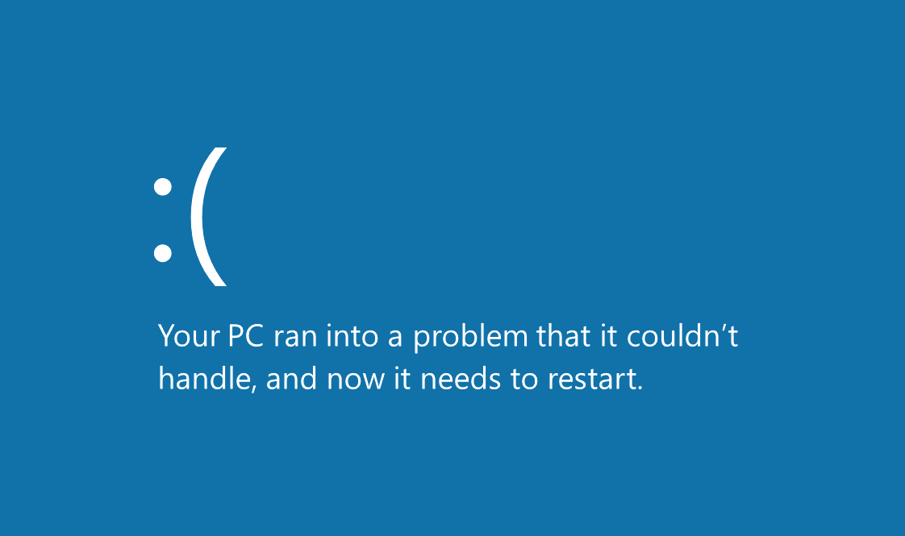

# 8 Times I Broke Linux and Why You Should Too

*2020-08-01 by Calvin Huang*

## Introduction

It's the week before Finals, and I'm in the middle of a few coding projects when everything screeches to a halt: I get the dreaded Blue Screen of Death. My heart racing, I restart my PC and breath a sigh of relief when I see the Windows logo start up again. Over the next few weeks, this became a regular occurrence, with each relapse worsening the frequency of restarts I had to perform before finally getting to the startup screen. Two weeks in, and I had scoured all the Windows forums, learned more Powershell commands than I had ever wanted, and read enough system logs to diagnose the faulty hard disk. But with my luck, the warranty on my laptop had just expired three months ago. The only solution would be to get an HDD swap.

The point is, it took me two weeks to detect a simple unmounted disk, which was only possible after it had deteriorated enough disappear from the boot menu altogether. Funnily enough, any Unix or Linux user would tell you that they would know almost immediately when faced with a similar problem--these operating systems print logs on startup and shutdown that detect when drivers, storage, and desktop environments go haywire.

This difference in design boils down to a fundamental schism in philosophy; whereas Windows is created to push proprietary software and turn a profit, Linux leaves literally everything open--for us, the users, to explore. Whereas configuring proprietary software lands you a few hours with technical support, Linux leaves it to you and the community to hash it out on your own. And while that may seem like a daunting prospect, you'll find that having the transparency and freedom to work it out yourself--and with an entire world of Linux users behind you--affords you a plethora of benefits and better yet, opportunities to truly understand how your operating system works.

## Table of Contents

- [8 Times I Broke Linux and Why You Should Too](#8-times-i-broke-linux-and-why-you-should-too)
  - [Introduction](#introduction)
  - [Table of Contents](#table-of-contents)
  - [1. In the beginning](#1-in-the-beginning)
  - [2. Playing with fire](#2-playing-with-fire)
  - [3. Pop! OS triple boot](#3-pop-os-triple-boot)
  - [4. The absolute size of those logs](#4-the-absolute-size-of-those-logs)
  - [5. iPad shenanigans](#5-ipad-shenanigans)
    - [Part One](#part-one)
    - [Part Two](#part-two)
  - [6. I hate bricks](#6-i-hate-bricks)
  - [7. Deepin destroys my desktop](#7-deepin-destroys-my-desktop)
  - [8. KDE and I have a tentative relationship...](#8-kde-and-i-have-a-tentative-relationship)

## 1. In the beginning

## 2. Playing with fire 

Messing with Drivers and heat reduction solutions

## 3. Pop! OS triple boot

## 4. The absolute size of those logs

## 5. iPad shenanigans

### Part One

### Part Two

## 6. I hate bricks

## 7. Deepin destroys my desktop

## 8. KDE and I have a tentative relationship...

