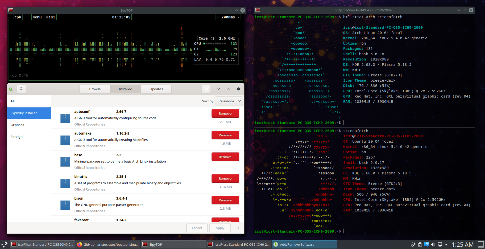

# Experimenting with Bedrock Linux 0.7

*2020-08-24 by Calvin Huang*

<picture>
    <source id="s1" srcset="/posts/images/bedrock0.7.png">
    <souce id="s2" srcset="images/bedrock0.7.png">
    
</picture>

I've always liked Arch's access to bleeding-edge software repositories and Debian's stability, but multi-booting two Linux distributions comes with many inconveniences, such as having to reboot every time you want to access a certain set of tools on a certain distribution or having two different file systems (under most circumstances). Bedrock Linux is a project that promises to allow users to pick and choose processes from different Linux distributions, such as the ability to use multiple package managers within a single operating system.

## How it Works

Bedrock Linux functions using "strata", which contain files and processes that provide distro-like functionality. Each strata that is installed gives the user the ability to access the software and package managers from that stratum, allowing processes from multiple different Linux distributions to run simultaneously on a single operating system.

The management of various strata is carried out using the core Bedrock utilities which are contained in a Bedrock stratum that is preloaded with the initial install. This gives access to commands such as `brl fetch <dist>`, which installs a new stratum for a specified distribution if it exists. Once multiple strata are installed on the user's machine, commands across all strata can be inputed from the command line. 

## Installation

Installing Bedrock Linux is simple, albeit less intuitive than using a typical distribution. The installation process has to actually happen on top of an already-existent Linux installation, as Bedrock uses a "hijack install" to convert the existing distribution into a stratum and install the Bedrock stratum. Bedrock recommends using a fresh Linux installation, as it lowers the chance of some incompatibility issues introduced via previous tinkering with the operating system.

For my system, I opted to use a fresh Kubuntu 20.04 installation to test out Bedrock. My choice of the Kubuntu was its stability for supporting both the KDE and Ubuntu-GNOME desktop environments, as base Ubuntu runs into compatibility issues when running both, as well as the fact that Kubuntu contains less preloaded software. Ubuntu as a base installation was only chosen due to its simple install process, which is the recommendation that Bedrock gives for determining what distribution to hijack. Some distribution are not as compatible as others, such as Manjaro, which currently lacks an active distro maintainer for Bedrock. However, most major players such as Ubuntu, Arch, Debian, and Fedora are well supported and have little to no known issues.

For hijacking, all you have to do is download a copy of the script for your specific architecture from [here](https://raw.githubusercontent.com/bedrocklinux/bedrocklinux-userland/0.7/releases) and run the installer running the following command as root: 

`sh ./bedrock-linux-<release>-<architecture>.sh --hijack` 

Downloading the script can be done by opening the given URL in the browser of your choice or by using `curl` on the Github raw of the script. 

Finish the installation by rebooting your machine again. You should then see a boot selection screen for Bedrock Linux. For the official installation instructions, visit the Bedrock documentation at: https://bedrocklinux.org/0.7/installation-instructions.html

## Exploring Bedrock Features

To get started, Bedrock provides a very helpful interactive tutorial via the `brl tutorial basics` command. However, here are several things I personally tried in my Bedrock setup:

- The first thing I did was run `brl fetch arch` as root in order to test if Pacman could run alongside the Apt package manager. As a test, I installed `screenfetch` on both strata and noticed that simple entering the `screenfetch` command would run whichever version had been most recently installed. However, `brl` provides a utility for running stratum-specific commands by using `brl strat <stratum-name`.

  For example, I was able to run `screenfetch` for Ubuntu and Arch separately by running `brl strat ubuntu screenfetch` and `brl strat arch screenfetch`, allowing me to show off the multiple distributions running on the machine.

- I wanted to test the stability of editing system config files, so I successfully installed `bpytop` and added the script to my `PATH` in my `.bashrc`. I also wanted to see if configuring the Arch strata was possible, so I tweaked the Pacman config file, which was located at `/bedrock/strata/arch/etc/`. Those familiar with the layout of the Linux filesystem will notice that the paths for stratum-specific configs and utilities are essentially identical aside from the fact that they start from `bedrock/strata/<strata name>` instead of from the root directory.

  Next, I wanted access AUR (a community-driven repository) packages with Arch, so I tried installing `yay`, which is a tool for searching and installing AUR software. I was able to install the `base-devel` packages as usual, allowing me to use `makepkg` to build `yay` in my Arch stratum. I was then able to use `yay` to successfully install the `pamac-aur` GUI, which I was able to run despite executing all of this on a Kubuntu desktop stratum.

## Conclusion

Bedrock Linux is a surprisingly simple and stable solution for using multiple Linux distributions simultaneously within a single, unified system. While this does add some complexity to your typical distribution, it also gives the overwhelming advantage of having access to almost any repository and software from any distribution. The strata system seems to give Bedrock the ability to maintain up-to-date versions for each distribution as well as the ability to completely customize each strata individually. Bedrock also functions like a boot-loader for all of its strata, allowing the user to potentially have uniquely configured desktops for each stratum and  the ability to boot into each without needing to repartition the drive.

I encourage anyone interested in this kind of functionality to visit the official Bedrock Linux website and contribute to the project, either by getting involved with the community or by offering to maintain compatibility with a certain distribution, as the project is relatively new and is always improving its support for its various strata. I had a lot of fun testing this unique distribution on a KVM machine, and I am likely going to convert one of my physical partitions to Bedrock!